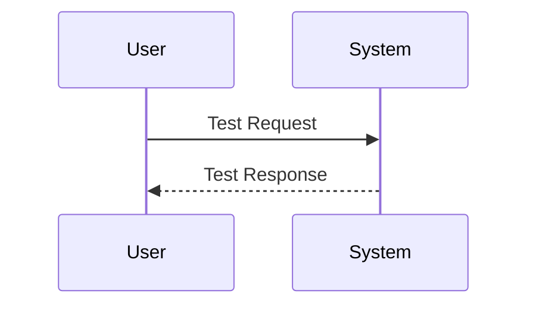

# Migration Guide: VSIX Packaging Restructure

## Overview

This guide helps you migrate from the previous version of the SO Workspace extension (which bundled mermaid-cli) to the new version (which requires separate mermaid-cli installation).

## What Changed

### Previous Version (Bundled Approach)

- Mermaid CLI was bundled with the extension
- No separate installation required
- VSIX package was 1GB+ in size
- Packaging process frequently timed out
- Extension included all node_modules in the package

### New Version (Separate Installation)

- Mermaid CLI must be installed separately by the user
- Extension automatically detects mermaid-cli installations
- VSIX package is under 10MB
- Packaging completes successfully
- Extension uses esbuild to bundle JavaScript dependencies
- No node_modules included in VSIX package

## Why This Change?

The bundled approach had critical issues:

1. **Package Size**: Including @mermaid-js/mermaid-cli with Puppeteer's Chromium binaries created a 1GB+ package
2. **Packaging Timeouts**: The large package size caused frequent packaging failures
3. **Distribution Issues**: 1GB+ packages are impractical to distribute and install
4. **Maintenance Burden**: Bundling large binaries made updates difficult

The new approach solves these issues while maintaining full functionality.

## Migration Steps

### Step 1: Install Mermaid CLI

Choose one of the following installation methods:

#### Option A: Global Installation (Recommended)

Install mermaid-cli globally to use it across all projects:

```bash
npm install -g @mermaid-js/mermaid-cli
```

**Verification:**
```bash
# Check installation
npm list -g @mermaid-js/mermaid-cli

# Test executable
mmdc --version
```

#### Option B: Project-Local Installation

Install mermaid-cli in your project's node_modules:

```bash
# Navigate to your project directory
cd /path/to/your/project

# Install as dev dependency
npm install --save-dev @mermaid-js/mermaid-cli
```

**Verification:**
```bash
# Check installation
npm list @mermaid-js/mermaid-cli

# Test executable
npx mmdc --version
```

### Step 2: Update the Extension

1. Uninstall the old version (optional but recommended):
   - Open VS Code Extensions view (Ctrl+Shift+X)
   - Find "SO Workspace" extension
   - Click the gear icon → Uninstall

2. Install the new version:
   - Download the latest `.vsix` file
   - Open VS Code
   - Go to Extensions view (Ctrl+Shift+X)
   - Click "..." menu → "Install from VSIX..."
   - Select the downloaded file

### Step 3: Verify Configuration

1. Open VS Code Settings (File → Preferences → Settings)
2. Search for "SO Workspace Diagrams"
3. Check "Mermaid CLI Path" setting:
   - **Default value**: `mmdc` (enables auto-detection)
   - **Custom value**: Only needed if you installed mermaid-cli in a non-standard location

**No configuration changes needed in most cases** - the default "mmdc" setting enables automatic detection.

### Step 4: Reload VS Code

Reload VS Code to ensure the extension detects your mermaid-cli installation:

1. Open Command Palette (Ctrl+Shift+P)
2. Type "Developer: Reload Window"
3. Press Enter

### Step 5: Test Mermaid Rendering

1. Open a Mermaid diagram file (`.mmd`) in your workspace
2. Try rendering the diagram using the extension
3. Verify the diagram renders successfully

If you encounter errors, see the Troubleshooting section below.

## Configuration Changes

### No Changes Required (Default Behavior)

If you were using the default configuration, no changes are needed:

```json
{
  "so-workspace.diagrams.java.mermaidCliPath": "mmdc"
}
```

The extension will automatically detect your mermaid-cli installation.

### Custom Path Configuration (If Needed)

If you have mermaid-cli installed in a non-standard location:

1. Open VS Code Settings
2. Search for "SO Workspace Diagrams"
3. Set "Mermaid CLI Path" to your custom path:
   - Windows example: `C:\tools\mermaid-cli\mmdc.cmd`
   - macOS/Linux example: `/opt/mermaid-cli/mmdc`

## Detection System

The extension automatically detects mermaid-cli in this order:

1. **Custom Configured Path** (highest priority)
   - If you set a custom path in settings (other than "mmdc")
   - Extension validates the path and uses it if valid

2. **Project-Local Installation**
   - Checks `<workspace>/node_modules/.bin/mmdc`
   - Useful for project-specific versions

3. **Global npm Installation** (lowest priority)
   - Checks global npm installation directory
   - Found using `npm root -g`

The extension uses the first valid installation it finds.

## Verification Steps

### Verify Mermaid CLI Installation

```bash
# Check if mermaid-cli is installed globally
npm list -g @mermaid-js/mermaid-cli

# Check if mermaid-cli is installed in project
npm list @mermaid-js/mermaid-cli

# Test the mmdc command
mmdc --version
```

### Verify Extension Detection

1. Open VS Code Output panel (View → Output)
2. Select "SO Workspace" from the dropdown
3. Look for messages about mermaid-cli detection
4. If mermaid-cli is not found, you'll see an error with installation instructions

### Verify Rendering Works

1. Create a test Mermaid file:



2. Save as `test.mmd`
3. Use the extension to render the diagram
4. Verify the output is generated successfully

## Troubleshooting

### Error: "Mermaid CLI (mmdc) not found"

**Cause**: Mermaid CLI is not installed or not detected by the extension.

**Solution**:
1. Install mermaid-cli:
   ```bash
   npm install -g @mermaid-js/mermaid-cli
   ```
2. Reload VS Code
3. Try rendering again

### Error: "Configured Mermaid CLI path is invalid"

**Cause**: You configured a custom path that doesn't exist or isn't accessible.

**Solution**:
1. Open VS Code Settings
2. Search for "Mermaid CLI Path"
3. Either:
   - Reset to default "mmdc" for auto-detection, OR
   - Correct the custom path to point to a valid mmdc executable

### Error: "Mermaid CLI found but not executable"

**Cause**: The mmdc file exists but doesn't have execute permissions (Unix systems).

**Solution**:
```bash
# Find the mmdc location
which mmdc

# Add execute permission
chmod +x /path/to/mmdc
```

### Extension Can't Detect Global Installation

**Cause**: npm global installation directory is not in the standard location.

**Solution**:
1. Find your global npm directory:
   ```bash
   npm root -g
   ```
2. Locate the mmdc executable:
   - Windows: `<npm-root>\.bin\mmdc.cmd`
   - Unix: `<npm-root>/.bin/mmdc`
3. Configure the full path in VS Code settings

### Extension Can't Detect Project-Local Installation

**Cause**: Mermaid CLI is installed but not in the expected location.

**Solution**:
1. Verify installation:
   ```bash
   npm list @mermaid-js/mermaid-cli
   ```
2. Check if `node_modules/.bin/mmdc` exists
3. If not, reinstall:
   ```bash
   npm install --save-dev @mermaid-js/mermaid-cli
   ```

### Platform-Specific Issues

#### Windows

- Extension looks for `mmdc.cmd` (not `mmdc`)
- Ensure npm global bin directory is in PATH
- Check: `where mmdc.cmd`

#### macOS/Linux

- Extension looks for `mmdc` (not `mmdc.cmd`)
- Ensure execute permissions: `chmod +x $(which mmdc)`
- Check: `which mmdc`

## Benefits of the New Approach

### For Users

1. **Smaller Downloads**: Extension is under 10MB instead of 1GB+
2. **Faster Installation**: Extension installs in seconds
3. **Version Control**: Choose your preferred mermaid-cli version
4. **Automatic Detection**: Works without manual configuration in most cases
5. **Clear Error Messages**: Specific installation instructions when needed

### For Developers

1. **Successful Packaging**: No more packaging timeouts
2. **Easier Maintenance**: Smaller package is easier to update
3. **Better Testing**: Can test with different mermaid-cli versions
4. **Cleaner Architecture**: Separation of concerns between extension and CLI tools

## Rollback (If Needed)

If you need to rollback to the previous version:

1. Uninstall the new version
2. Install the old version from your backup `.vsix` file
3. The old version will use the bundled mermaid-cli

**Note**: Rollback is not recommended as the old version has packaging issues.

## Support

If you encounter issues not covered in this guide:

1. Check the Output panel (View → Output → SO Workspace) for detailed errors
2. Review the troubleshooting section in README.md
3. Verify your mermaid-cli installation: `mmdc --version`
4. Check the extension's GitHub issues for similar problems
5. Create a new issue with:
   - Your operating system
   - VS Code version
   - Extension version
   - Mermaid CLI version (`mmdc --version`)
   - Error messages from Output panel

## Summary

The migration process is straightforward:

1. ✅ Install mermaid-cli globally or in your project
2. ✅ Update to the new extension version
3. ✅ Reload VS Code
4. ✅ Verify rendering works

The new approach provides a better experience with smaller package size, faster installation, and automatic detection of mermaid-cli installations.
