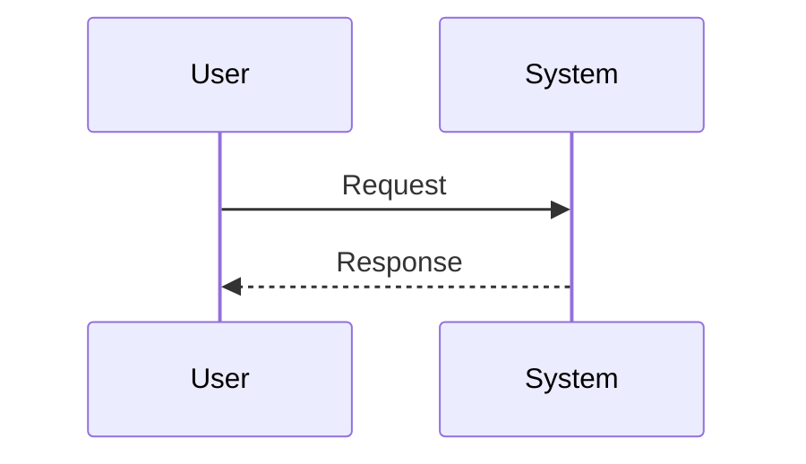

# SO Workspace VSIX Extension

A Visual Studio Code extension that provides a **deterministic, step-by-step workflow** for producing enterprise-grade Solution Outlines from Business Requirements Documents (BRDs).

This extension packages all runtime assets (prompts, templates, rules) internally and operates on external project workspaces, keeping your projects clean and focused on generated artifacts.

---

## Features

- **Ordered Workflow**: Enforced execution sequence from requirements to solution outline
- **Review-Driven**: Each stage produces artifacts that are validated before progressing
- **Architecture-Safe**: Prevents architectural drift through structured inputs and derived outputs
- **Workspace Initialization**: One-command setup for new SO projects
- **Asset Management**: All extension assets are packaged internally, no workspace pollution

---

## Installation

### From VSIX Package

1. Download the latest `.vsix` file from releases
2. Open VS Code
3. Go to Extensions view (Ctrl+Shift+X)
4. Click the "..." menu at the top
5. Select "Install from VSIX..."
6. Choose the downloaded `.vsix` file

### From Source

```bash
# Clone the repository
git clone <repository-url>
cd <repository-name>

# Install dependencies
npm install

# Build the extension
npm run compile

# Package the extension
npm run package

# Install the generated .vsix file in VS Code
```

### Required Local Tools for Diagram Rendering

The extension uses **local rendering only** for all diagram types, with no external API dependencies. This ensures offline operation and data privacy.

#### Required Tools

1. **Java Runtime Environment (JRE)**
   - Required for PlantUML rendering
   - Version 8 or higher recommended
   - Download: https://www.oracle.com/java/technologies/downloads/

2. **PlantUML JAR**
   - Required for PlantUML diagram rendering
   - Default location: `tools/plantuml/plantuml-1.2026.1.jar` (relative to workspace root)
   - Download latest: https://plantuml.com/download
   - Configure path in settings: `so-workspace.diagrams.java.plantUmlJarPath`

3. **Mermaid CLI**
   - **Required separate installation** - Must be installed by the user
   - The extension will automatically detect your mermaid-cli installation
   - Install globally (recommended):
     ```bash
     npm install -g @mermaid-js/mermaid-cli
     ```
   - Or install in your project:
     ```bash
     npm install --save-dev @mermaid-js/mermaid-cli
     ```
   - Configure custom path in settings: `so-workspace.diagrams.java.mermaidCliPath` (default: `mmdc` enables auto-detection)

4. **Docker**
   - Required for Structurizr DSL rendering
   - Download: https://www.docker.com/products/docker-desktop
   - Used to run Structurizr CLI containers defined in `docker-compose.structurizr.yml`

#### Docker Setup for Structurizr

To render Structurizr DSL files (`.dsl`), you need Docker running with the Structurizr containers:

```bash
# Start Structurizr containers
docker-compose -f docker-compose.structurizr.yml up -d

# Verify containers are running
docker ps

# Stop containers when done
docker-compose -f docker-compose.structurizr.yml down
```

The extension will automatically use the Docker containers for Structurizr rendering. Configure the container name and CLI path in settings if needed:
- `so-workspace.diagrams.structurizrCliContainer` (default: `structurizr-cli`)
- `so-workspace.diagrams.structurizrCliPath` (default: `/usr/local/structurizr-cli/structurizr.sh`)

#### Configuration

All local tool paths can be configured in VS Code settings (File → Preferences → Settings → SO Workspace Diagrams):

- **PlantUML JAR Path**: Path to PlantUML JAR file (relative to workspace root)
- **Mermaid CLI Path**: Path to `mmdc` executable (default: `mmdc` enables auto-detection)
  - The extension automatically detects mermaid-cli in this order:
    1. Custom configured path (if not default "mmdc")
    2. Project-local installation (`node_modules/.bin/mmdc`)
    3. Global npm installation
- **Java Path**: Path to Java executable (default: `java` in PATH)
- **Structurizr CLI Container**: Docker container name for Structurizr CLI
- **Structurizr CLI Path**: Path to structurizr.sh inside the container

---

## Getting Started

### 1. Initialize a New SO Workspace

Open an empty folder in VS Code and run:

**Command Palette** (Ctrl+Shift+P): `SO: 0-02 Initialize SO Workspace Structure`

This creates the required folder structure and template files:

```
docs/
 ├─ 01_requirements/
 ├─ 02_objectives/
 │   └─ flows.yaml
 ├─ 03_architecture/
 │   └─ diagrams/
 │       ├─ src/seq/
 │       └─ src/flow/
 ├─ project_information.md
 ├─ README_SO_Workspace.md
 └─ .so-workspace.json
```

### 2. Follow the Ordered Workflow

The extension provides numbered commands that should be executed in sequence. See the complete workflow in your workspace's `docs/README_SO_Workspace.md` after initialization.

---

## Mermaid Diagram Support

The extension includes built-in support for validating and rendering Mermaid diagrams locally.

### Diagram Type Declarations

All Mermaid diagram files (`.mmd`) **must** begin with a valid diagram type declaration. This is the first non-comment line in your file.

**Valid diagram type declarations:**

```mermaid
sequenceDiagram
flowchart TD
graph LR
classDiagram
stateDiagram-v2        # Recommended (stateDiagram is legacy)
erDiagram
journey
gantt
pie
gitGraph
mindmap
timeline
quadrantChart
requirementDiagram
C4Context
C4Container
C4Component
C4Dynamic
C4Deployment
```

**Note:** `stateDiagram` (without -v2) is a legacy version. Use `stateDiagram-v2` for better compatibility with current Mermaid versions.

**Example valid Mermaid file:**



**Example invalid Mermaid file (missing type):**

```mermaid
%% This will fail validation
participant User
participant System
User->>System: Request
```

### Automatic Syntax Repair

If you have Mermaid files missing diagram type declarations, use the repair command:

**Command Palette** (Ctrl+Shift+P): `SO: Fix Mermaid Diagram Syntax`

This command will:
1. Scan all `.mmd` files in your workspace
2. Detect files missing diagram type declarations
3. Analyze content to infer the correct diagram type
4. Automatically prepend the diagram type (for high/medium confidence)
5. Create `.bak` backup files before modifying
6. Report files requiring manual intervention (low confidence)

**Repair confidence levels:**
- **High confidence**: Unique keywords detected (e.g., "participant" → sequenceDiagram)
- **Medium confidence**: Common patterns detected (e.g., "class" → classDiagram)
- **Low confidence**: Ambiguous content, manual review required

### Local Rendering

The extension renders all diagrams locally using the following tools:
- **Mermaid diagrams (.mmd)**: Rendered using `@mermaid-js/mermaid-cli` (mmdc)
- **PlantUML diagrams (.puml)**: Rendered using PlantUML JAR with Java
- **Structurizr DSL (.dsl)**: Rendered using Docker-based Structurizr CLI

All diagrams are validated before rendering to catch syntax errors early. No external APIs or cloud services are used for rendering, ensuring complete offline operation and data privacy.

---

## Extension Development

### Prerequisites

- Node.js 16.x or higher
- npm 8.x or higher
- VS Code 1.80.0 or higher

### Project Structure

```
repository-root/
├── src/                      # Extension source code
│   ├── extension.ts         # Extension entry point
│   ├── asset-resolver.ts    # Asset path resolution
│   ├── workspace-initializer.ts  # Workspace setup
│   └── commands/            # Command handlers
├── assets/                   # Runtime assets (packaged with extension)
│   ├── agent/               # Prompts and rules
│   └── templates/           # Document templates
├── package.json             # Extension manifest
├── tsconfig.json            # TypeScript configuration
└── README.md                # This file
```

### Build Commands

```bash
# Install dependencies
npm install

# Compile TypeScript
npm run compile

# Watch mode for development
npm run watch

# Run tests
npm test

# Package extension
npm run package

# Verify VSIX contents
npm run verify-vsix
```

### Testing

```bash
# Run unit tests
npm test

# Run integration tests
npm run test:integration

# Run with coverage
npm run test:coverage
```

### Asset Resolution

The extension uses a centralized `AssetResolver` to locate runtime assets:

```typescript
import { AssetResolver } from './asset-resolver';

// In your command handler
const assetResolver = new AssetResolver(context);
const promptUri = assetResolver.getPromptPath('01_requirements/00_extract_requirements_inventory.prompt.md');
const content = await assetResolver.readAsset(promptUri);
```

All assets are resolved using the extension installation path, ensuring they work regardless of workspace structure.

---

## Contributing

### Adding New Commands

1. Create command handler in `src/commands/`
2. Use `AssetResolver` for any asset access
3. Register command in `src/extension.ts`
4. Add command to `package.json` contributes section
5. Update documentation

### Adding New Assets

1. Place assets in appropriate `assets/` subdirectory:
   - Prompts: `assets/agent/prompts/`
   - Templates: `assets/templates/`
   - Rules: `assets/agent/rules/`
2. Access via `AssetResolver` methods
3. Verify inclusion in VSIX with `npm run verify-vsix`

---

## Troubleshooting

### Mermaid CLI Installation Issues

If you see errors about mermaid-cli not being found:

1. **Verify mermaid-cli is installed**:
   ```bash
   # Check global installation
   npm list -g @mermaid-js/mermaid-cli
   
   # Check project-local installation
   npm list @mermaid-js/mermaid-cli
   ```

2. **Install mermaid-cli if missing**:
   ```bash
   # Global installation (recommended)
   npm install -g @mermaid-js/mermaid-cli
   
   # Or project-local installation
   npm install --save-dev @mermaid-js/mermaid-cli
   ```

3. **Verify mmdc is accessible**:
   ```bash
   # Test the command
   mmdc --version
   ```

4. **Check detection order**:
   - The extension searches for mermaid-cli in this order:
     1. Custom path configured in settings (if not "mmdc")
     2. Project `node_modules/.bin/mmdc`
     3. Global npm installation
   - If you have multiple installations, the extension uses the first one found

5. **Configure custom path** (if needed):
   - Open VS Code Settings (File → Preferences → Settings)
   - Search for "SO Workspace Diagrams"
   - Set "Mermaid CLI Path" to your custom installation path
   - Example: `/usr/local/bin/mmdc` or `C:\Users\YourName\AppData\Roaming\npm\mmdc.cmd`

6. **Platform-specific notes**:
   - **Windows**: The extension looks for `mmdc.cmd`
   - **macOS/Linux**: The extension looks for `mmdc`
   - Ensure the executable has proper permissions on Unix systems: `chmod +x /path/to/mmdc`

7. **Reload VS Code** after installing mermaid-cli to ensure the extension detects it

If problems persist, check the Output panel (View → Output → SO Workspace) for detailed error messages.

### Extension Can't Find Assets

If you see errors about missing assets:

1. Verify the extension is properly installed
2. Try reinstalling the extension
3. Check that assets are included in the VSIX package
4. Run `npm run verify-vsix` during development

### Workspace Initialization Fails

If workspace initialization fails:

1. Ensure you have write permissions in the workspace folder
2. Check that the workspace is not read-only
3. Try closing and reopening VS Code
4. Check the Output panel (View → Output → SO Workspace) for detailed errors

---

## License

[Your License Here]

---

## Support

For issues, questions, or contributions, please visit the repository issue tracker.
