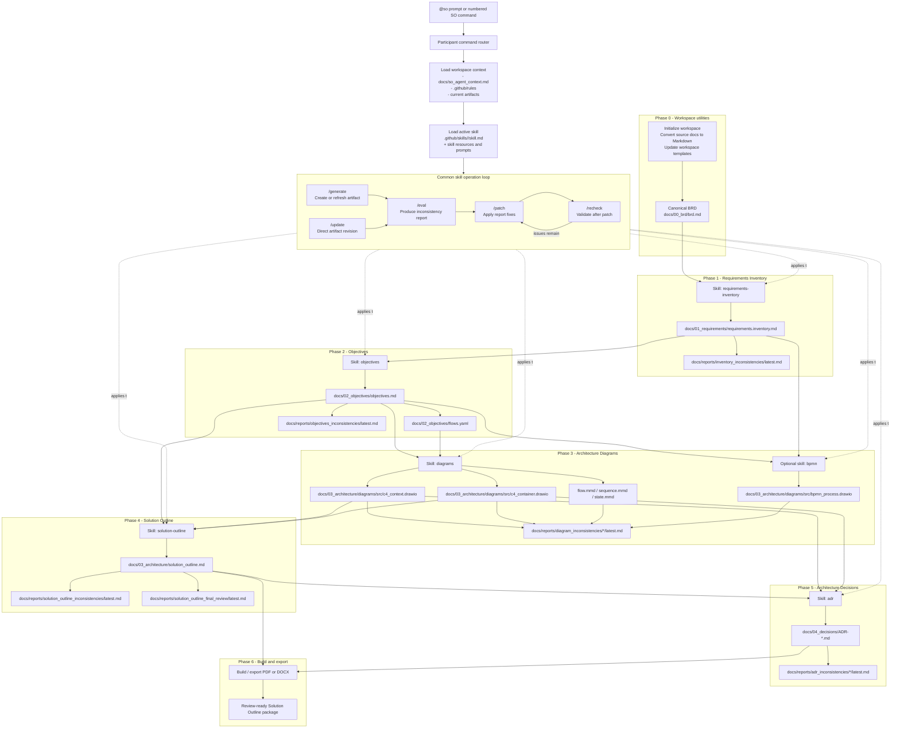

# Phase and Skill Usage

This diagram shows how the Solution Outline workflow phases build on each other, and which workspace skill is used in each phase.



## Phase-to-skill map

| Phase | Primary skill | Main inputs | Main output |
| --- | --- | --- | --- |
| 0 - Workspace utilities | No artifact skill; workspace commands | BRD source files, templates | Initialized workspace and canonical BRD Markdown |
| 1 - Requirements Inventory | `requirements-inventory` | BRD, discussions, references | `docs/01_requirements/requirements.inventory.md` |
| 2 - Objectives | `objectives` | Requirements Inventory | `docs/02_objectives/objectives.md`, `docs/02_objectives/flows.yaml` |
| 3 - Architecture Diagrams | `diagrams`; optional `bpmn` | Objectives, flows, requirements, references | C4 draw.io diagrams, supporting Mermaid diagrams, BPMN draw.io diagram |
| 4 - Solution Outline | `solution-outline` | Objectives, validated diagrams | `docs/03_architecture/solution_outline.md` |
| 5 - Architecture Decisions | `adr` | Requirements, objectives, diagrams, Solution Outline | `docs/04_decisions/ADR-*.md` |
| 6 - Build and export | Export commands | Solution Outline, diagrams, ADRs | PDF/DOCX delivery package |

## Runtime pattern

At runtime, the `@so` participant determines the requested skill from the slash command, aliases, diagram selection, or prompt keywords. It then loads the workspace-owned skill from `.github/skills`, adds the relevant workspace context and rules, and executes the selected operation-specific prompt.

The same operation pattern is reused across the artifact skills:

```text
/generate -> /eval -> /patch -> /recheck
              ^
              |
          /update
```

Use `/update` when the architect wants a direct change from new context or feedback. Use `/patch` when there is already an inconsistency report and the fixes should stay scoped to reported issue IDs.
