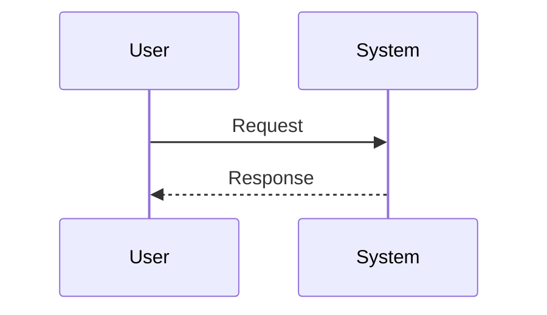

# SO Workspace Usage Guide

Welcome to your Solution Outline (SO) workspace! This guide will help you understand the structure and workflow for creating comprehensive solution documentation from Business Requirements Documents (BRDs).

## About This Workspace

This workspace was initialized using the **SO Workspace VSIX Extension**. The extension provides a deterministic, step-by-step workflow that ensures traceability from requirements to final solution outline.

### Execution Philosophy

- Each stage produces an artifact that becomes the **source of truth** for the next stage
- Outputs are validated before progressing
- Generated content is **reviewed and refined**, not blindly accepted
- Diagrams and documents are always derived from structured inputs, not edited independently

## Workspace Structure

Your workspace is organized into the following directories:

```
docs/
├── 00_brd/                    # Business Requirements Document (place your BRD here)
├── 01_requirements/           # Requirements inventory (generated)
├── 02_objectives/             # Objectives and flows (generated)
│   └── flows.yaml            # Canonical flow definitions
├── 03_architecture/           # Architecture diagrams (generated)
│   └── diagrams/
│       ├── src/              # Source diagram files
│       │   ├── seq/         # Sequence diagrams
│       │   └── flow/        # Flow diagrams
│       └── out/             # Rendered diagram outputs
├── project_information.md     # Project metadata (update this)
├── README_SO_Workspace.md    # This file
└── .so-workspace.json        # Workspace sentinel file (do not delete)
```

## Workflow Stages

The SO methodology follows a structured workflow with ordered execution. Commands should be executed **top-to-bottom** in the sequence shown below.

### Stage 0: Workspace Utilities

**SO: 0-00 Reset Generated Files**  
`so.resetGeneratedFiles`  
Clears generated artifacts to start fresh.

**SO: 0-01 Convert Word to Markdown**  
`so-workspace.convertWordToMarkdown`  
Converts Word documents to Markdown format for processing.

**SO: 0-02 Initialize SO Workspace Structure**  
`so-workspace.initializeWorkspace`  
Creates the workspace folder structure and template files. This command is idempotent and safe to run multiple times.

---

### Stage 1: Requirements Inventory

**Purpose:** Extract and organize requirements from the BRD into a structured inventory.

**Commands (Generate → Evaluate → Patch → Recheck):**
- **SO: 1-01 Requirements Inventory Generate (Open Chat)**  
  `so-workspace.req.generate`
- **SO: 1-02 Requirements Inventory Evaluate (Open Chat)**  
  `so-workspace.req.eval`
- **SO: 1-03 Requirements Inventory Patch (Open Chat)**  
  `so-workspace.req.patch`
- **SO: 1-04 Requirements Inventory Recheck (Open Chat)**  
  `so-workspace.req.recheck`

**Output:** `docs/01_requirements/requirements.inventory.md`

The Requirements Inventory is the structured representation of the BRD and acts as the **requirements baseline** for all subsequent stages.

---

### Stage 2: Objectives

**Purpose:** Define high-level objectives and map them to requirements. Objectives represent the **architectural interpretation of requirements** and are the **primary source of truth** for flows and diagrams.

**Commands (Generate → Evaluate → Patch → Recheck):**
- **SO: 2-01 Objectives Generate (Open Chat)**  
  `so-workspace.obj.generate`
- **SO: 2-02 Objectives Evaluate (Open Chat)**  
  `so-workspace.obj.eval`
- **SO: 2-03 Objectives Patch (Open Chat)**  
  `so-workspace.obj.patch`
- **SO: 2-04 Objectives Recheck (Open Chat)**  
  `so-workspace.obj.recheck`

**Output:** `docs/02_objectives/objectives.md`

---

### Stage 3: Architecture Diagrams

**Purpose:** Create C4 architecture diagrams (Context and Container levels) validated against Objectives and approved flows.

**Commands (C4 + Render → Evaluate → Patch → Recheck):**
- **SO: 3-01 Generate C4 Context Diagram (Open Chat)**  
  `so-workspace.diagram.generateC4Context`
- **SO: 3-02 Generate C4 Container Diagram (Open Chat)**  
  `so-workspace.diagram.generateC4Container`
- **SO: 3-03 Render Diagrams (Local)**  
  `so-workspace.renderDiagrams`
- **SO: 3-04 Diagram Evaluate (Select Diagram)**  
  `so-workspace.diagram.eval`
- **SO: 3-05 Diagram Patch (Select Diagram)**  
  `so-workspace.diagram.patch`
- **SO: 3-06 Diagram Recheck (Select Diagram)**  
  `so-workspace.diagram.recheck`

**Output:** Structurizr DSL files in `docs/03_architecture/diagrams/src/`

---

### Stage 4: Solution Outline

**Purpose:** Create detailed solution outline with flows, state changes, and error handling. The Solution Outline is generated only after Objectives, Flows, and Diagrams have stabilized.

**Commands (Generate → Evaluate → Patch → Final Review):**
- **SO: 4-01 Solution Outline Generate (Open Chat)**  
  `so-workspace.so.generate`
- **SO: 4-02 Solution Outline Evaluate (Objectives + Diagrams)**  
  `so-workspace.so.eval`
- **SO: 4-03 Solution Outline Patch (Open Chat)**  
  `so-workspace.so.patch`
- **SO: 4-04 Solution Outline Final Review (Requirements Inventory)**  
  `so-workspace.so.finalReview`

**Output:** Updated `docs/02_objectives/flows.yaml` with complete flow definitions

---

### Stage 5: Build & Export

**Purpose:** Generate PDF documentation from your solution outline.

**Commands:**
- **SO: 5-01 Build PDF (Docker)**  
  `so-workspace.buildPdf`
- **SO: 5-02 Export PDF**  
  `so-workspace.exportPdfNpm`
- **SO: 5-03 Open Generated PDF**  
  `so-workspace.openGeneratedPdf`

## Ordered Execution Sequence

Follow this sequence for best results:

1. **Initialize Workspace** - Run `SO: 0-02 Initialize SO Workspace Structure` to set up folder structure and templates
2. **Place BRD** - Add your Business Requirements Document to `docs/00_brd/`
3. **Requirements Inventory** - Extract and validate requirements (Stage 1)
4. **Objectives** - Define and validate objectives (Stage 2)
5. **Diagrams** - Create and validate architecture diagrams (Stage 3)
6. **Solution Outline** - Create and validate detailed flows (Stage 4)
7. **Export** - Generate PDF documentation (Stage 5)

Each stage builds upon the previous one, so it's important to complete them in order.

## Flow Modeling (Canonical Flows)

### Purpose

After Objectives are finalized, the workspace defines **Canonical Flows** in a single, human-readable YAML file. Canonical flows enable deterministic generation of **high-level sequence diagrams**, which implementation teams use to understand interaction flows before detailed analysis.

### Canonical Source of Truth

```
docs/02_objectives/flows.yaml
```

This file is the **only authoritative definition of flows**. Diagrams must always be generated from this file. Manual edits to diagrams without updating the YAML are not allowed.

### Ownership Model

- The agent may generate **initial flow drafts**
- The architect reviews, refines, and approves flows
- Only **approved flows** are used for delivery handover

This establishes a **hybrid model**: generation is automated, but ownership and accountability remain with the architect.

### Flow Definition (Minimum Contract)

A flow is considered **sequence-ready** only if it includes:

- A clear trigger (actor and intent)
- Canonical participants (actors, systems, containers)
- 5–12 meaningful steps (happy path)
- At least one high-level error case
- State transitions where applicable (e.g. booking, payment)

Flows that do not meet these criteria must not generate sequence diagrams.

### Handling Unknowns

When information is missing from the BRD or Objectives:

- Do not invent details
- Record gaps explicitly as open points in the flow definition
- Apply only generic defaults where allowed

## Working with Flows

The `flows.yaml` file is the heart of your solution outline. It contains:

- **Meta information** - Document metadata and sources
- **Glossary** - Terms and definitions
- **Flows** - Detailed flow definitions with:
  - Participants (actors, containers, systems)
  - Steps (interactions between participants)
  - State changes (entity lifecycle)
  - Error cases (exception handling)
  - Non-functional requirements
  - Mappings to objectives and requirements

### Diagram Generation from Flows

From `flows.yaml`, the workspace can generate:

- **Mermaid sequence diagrams** - Primary deliverable for development and integration teams
- **Mermaid flowcharts** (optional) - Useful for business discussions and decision-heavy processes

Recommended output locations:
```
docs/03_architecture/diagrams/src/seq/
docs/03_architecture/diagrams/src/flow/
```

Rendered diagrams are placed in `docs/03_architecture/diagrams/out/`

## Mermaid Diagram Syntax Requirements

### Diagram Type Declarations

All Mermaid diagram files (`.mmd`) **must** begin with a valid diagram type declaration. This is required for proper rendering and validation.

**Valid diagram type declarations:**

```
sequenceDiagram
flowchart TD
graph LR
classDiagram
stateDiagram-v2        # Recommended (stateDiagram is legacy)
erDiagram
journey
gantt
pie
gitGraph
mindmap
timeline
quadrantChart
requirementDiagram
C4Context
C4Container
C4Component
C4Dynamic
C4Deployment
```

**Note:** `stateDiagram` (without -v2) is a legacy version. Use `stateDiagram-v2` for better compatibility with current Mermaid versions.

**Example valid Mermaid file:**



**Example invalid Mermaid file (missing type):**

```mermaid
%% This will fail validation - missing diagram type
participant User
participant System
User->>System: Request
```

### Automatic Syntax Repair

If you have Mermaid files with missing diagram type declarations, the extension provides an automatic repair command:

**Command Palette** (Ctrl+Shift+P): `SO: Fix Mermaid Diagram Syntax`

**What the repair command does:**

1. Scans all `.mmd` files in your workspace
2. Detects files missing diagram type declarations
3. Analyzes file content to infer the correct diagram type
4. Automatically prepends the diagram type for high/medium confidence cases
5. Creates `.bak` backup files before modifying any files
6. Reports files requiring manual intervention (low confidence)

**Confidence levels:**

- **High confidence**: Unique keywords detected (e.g., "participant" → sequenceDiagram, "gantt" → gantt)
- **Medium confidence**: Common patterns detected (e.g., "class" → classDiagram, "state" → stateDiagram)
- **Low confidence**: Ambiguous content, requires manual review and correction

**When to use the repair command:**

- After generating new Mermaid diagrams
- When diagram rendering fails with validation errors
- Before running the diagram render command
- As part of your quality assurance process

**Best practice:** Run the repair command before rendering diagrams to catch syntax issues early.

### Validation Before Rendering

The extension automatically validates all Mermaid diagrams before rendering. If validation fails:

1. Review the error message showing which files have issues
2. Run the repair command to fix common issues automatically
3. Manually fix any files that require low-confidence intervention
4. Re-run the render command

This validation step prevents rendering failures and provides clear error messages to help you fix issues quickly.

## Re-initializing the Workspace

If you need to re-initialize your workspace:

1. The initialization command is **idempotent** and safe to run multiple times
2. Run `SO: 0-02 Initialize SO Workspace Structure` from the command palette
3. The extension will detect existing initialization (via `.so-workspace.json`)
4. You'll be prompted before any existing files are overwritten
5. Choose "Yes" to overwrite or "No" to keep existing files

The sentinel file `docs/.so-workspace.json` marks your workspace as initialized. Do not delete this file unless you want to reset the workspace completely.

## Best Practices

1. **Start with a good BRD** - The quality of your outputs depends on the quality of your inputs
2. **Follow the ordered sequence** - Complete stages in order (0 → 1 → 2 → 3 → 4 → 5)
3. **Review each stage** - Use the evaluate and recheck commands to ensure quality
4. **Iterate as needed** - Use patch commands to fix issues identified during evaluation
5. **Keep flows focused** - Each flow should represent a single business scenario
6. **Document assumptions** - Use the flows.yaml structure to capture assumptions and open points
7. **Don't skip validation** - The evaluate/patch/recheck cycle ensures quality and consistency
8. **Update project information** - Keep `project_information.md` current with project details

## Final Notes

- The pipeline is designed to be **repeatable and auditable**
- YAML artifacts are the canonical inputs; diagrams and documents are derived outputs
- The extension enforces order to prevent architectural drift and premature design decisions
- All extension assets (prompts, templates, rules) are packaged internally - your workspace stays clean

## Getting Help

- Review the command palette (`Ctrl+Shift+P` or `Cmd+Shift+P`) for all available SO commands
- Each command includes inline help and guidance
- Refer to the extension README for development and troubleshooting information
- Check the Output panel (View → Output → SO Workspace) for detailed error messages

## Project Information

Update `project_information.md` with your project details:
- Project name
- Description
- Version
- Stakeholders
- References

This information helps maintain context throughout the solution outline process.
