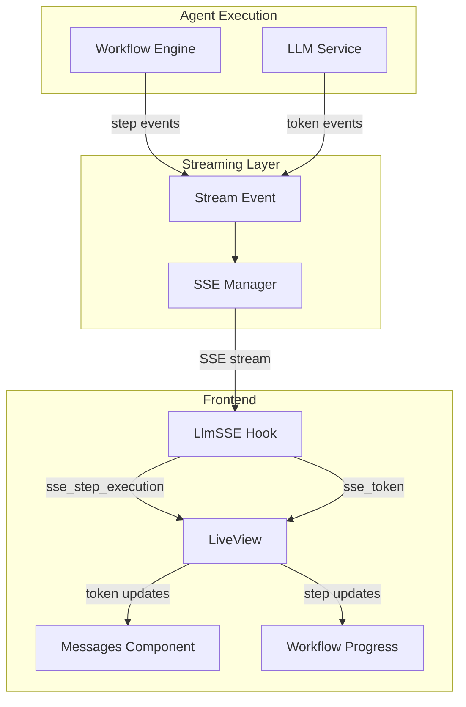

```mermaid
graph TB
    subgraph "Agent Execution"
        WE[Workflow Engine]
        LLM[LLM Service]
    end
    
    subgraph "Streaming Layer"
        SE[Stream Event]
        SSE[SSE Manager]
    end
    
    subgraph "Frontend"
        JSH[LlmSSE Hook]
        LV[LiveView]
        MC[Messages Component]
        WP[Workflow Progress]
    end
    
    WE -->|step events| SE
    LLM -->|token events| SE
    SE --> SSE
    SSE -->|SSE stream| JSH
    JSH -->|sse_step_execution| LV
    JSH -->|sse_token| LV
    LV -->|step updates| WP
    LV -->|token updates| MC
```